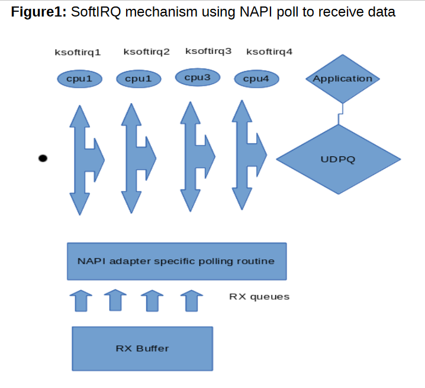

# Tunning Network trên OS linux 

Tunning Network Interface Card (NIC) nhằm tối ưu hóa thông lượng và độ trễ của hệ thống là một bước liên quan đến các thành phần phức tạp cần phải xem xét và tính toán. 

Bao gồm: 
- NIC
- Driver 
- Hardware
- OS version
- Kiến trúc CPU và memory
- Số lượng CPU core
- Khối lượng công việc mà interface cần xử lý(Bao gồm cả tốc độ và độ trễ)

Không có một cấu hình chuẩn nào có thể áp dụng cho tất cả các hệ thống, nhưng việc tìm hiểu cấu trúc hoạt động của nhân linux đối với NIC và điểu chỉnh các thông số để có thể áp vào một hệ thống nhất định 

Quá trình Kernel nhận 1 gói tin để xử lý.

## The NIC ring buffer

Giữa Nic và Devives khi nhận tín hiệu sẽ khởi tạo 1 một bộ đệm vòng, Card sẽ gán (TX) gửi và (RX) nhận cho bộ đệm này. Nó đơn giản chỉ là ghi đè dữ liệu hiện có.  Có 2 cách để chuyển Data từ NIC đến Kernel là `hardware interrupts` và `software interrupts` (hay còn được gọi là `SoftIRQs`)

Trong RX của bộ đệm vòng được sử dụng để lưu trức các tín hiệu đến cho đến khi chúng được xử lý bởi Devices. Trình điều khiển tháo vòng đệm RX thường là SoftIRQs đẩy gói tin đến kernal với cấu trúc `sk_buff` hoặc `skb` để bắt đầu vòng đệm khác. TX của bộ đệm được sử dụng đễ lưu trữ các packets đi cho đến khi được gửi đi hoàn toàn. 

Vòng đệm nằm ở dưới cùng của ngăn xếp và là một điểm quan trọng mà tại đó việc drop gói tin có thể xảy ra, điều này sẽ ảnh hưởng xấu đến hiệu suất của mạng.

##  interrupts và hardware interrupts

Quá trình ngắt được xử lý bởi phần cứng được gọi là `top-half` Khi NIC nhận data, nó sẽ copy data vào bộ đệm kernel bằng cách sử dụng DMA, NIC sẽ thông báo với kernel rằng data được ngắt. Cách ngắt dữ liệu này được xử lý bởi trình quản lý ngắt, tác vụ này tuy nhỏ nhưng nhằm đảm bảo việc 1 task nào đó ngắt dữ liệu để xử lý thêm 1 lần nữa. Việc sử dụng Hardware interrupts có thể hao tốn tài nguyên CPU khi kernel đang lock. 

Trình xử lý ngắt cứng sau đó tiếp nhận các gói tin của trình xử lý ngắt mềm hoặc SoftIRQ, quá trình này có thể được lập lịch để phù hợp hơn 

Quá trình xử lý ngắt cứng có thể theo dõi tại `cat /proc/interrupts` với mỗi queue là 1 quá trình ngắt dữ liệu, chúng được khởi tại khi hệ thống khởi động hoặc NIC có tải. Mỗi hàng đợi RX TX được gán 1 quá trình duy nhất thông báo xử lý các tác vụ ngắt khi data đến từ NIC/queue. Các cột đại diện cho giá trị ngắt như 1 bộ đếm. 
```sh 
[root@ceph1 ~]# egrep  "CPU0|em1" /proc/interrupts
            CPU0       CPU1       CPU2       CPU3       CPU4       CPU5       CPU6       CPU7       CPU8       CPU9       CPU10      CPU11      CPU12      CPU13      CPU14      CPU15      
  37:          0          0          0          0          0          0          0          0          0          0          1          0          0          0          0          0  IR-PCI-MSI-edge      em1
  38:        663        674       5385          0          0          0       6942          0          0      19618          0      10836          0        518          0          0  IR-PCI-MSI-edge      em1-TxRx-0
  39:          5       4990      56290        976        930       4471          0        870          0          0          0          0       2336        778          0          0  IR-PCI-MSI-edge      em1-TxRx-1
  40:        309        136       1027        635       8040        536       5947          0          0          0          0          0          0        536          0          0  IR-PCI-MSI-edge      em1-TxRx-2
  41:        952         91          0       2621          0       1487       2427       6041          0          0          0          0        611        394       4039          0  IR-PCI-MSI-edge      em1-TxRx-3
  42:          5          0          0          0          0          0          0          0          0          0          0          0          0          0          0      16250  IR-PCI-MSI-edge      em1-TxRx-4
  43:        204        203       1024          0       1190        989       4912          0          0          0          0          0          0         35       7819          0  IR-PCI-MSI-edge      em1-TxRx-5
  44:        625        529       1811       4259       3933         92       4275          0          0        529          0          0          0        333          0          0  IR-PCI-MSI-edge      em1-TxRx-6
  45:        446        770       3253        642       2934        953       1686          0          0        939          0       1718       2106        676          0          0  IR-PCI-MSI-edge      em1-TxRx-7
[root@ceph1 ~]# 
```

## 1. SoftIRQ misses (netdev budget) (TUNNING OPTION)

Quá trình ngắt được xử lý bởi phần mềm được gọi là `bottom-half` software interrupt requests (SoftIRQs) được lập lịch tự động thực hiện khi có 1 task không được ngắt. Mục đích chính của SoftIRQs là tạo một đường dẫn của network bộ đệm vòng , tiến trình tự động này chạy dưới dạng `ksoftirqd/cpu-number` và gọi hàm cụ thể của trình điều khiển. Chúng có thể thấy được trong các công cụ giám sát như `top` và `ps`

Đối với call stack, nó sẽ đọc dưới lên, VD: SoftIRQ lấy dữ liệu từ 1 card Melanox. Chức năng `[mlx4_en]` được đánh dấu sử dụng và  được vote từ module `Mlx4_en.ko` của kernel, được gọi bởi các trình vote của kernel như `net_rx_action`. Sau khi di chuyển từ trình điều khiển đến hạt nhân, lưu lượng truy cập sẽ nhận được sau đó di chuyển đến socket sẵn sàng cho ứng dụng sử dụng

```sh 
 mlx4_en_complete_rx_desc [mlx4_en]
   mlx4_en_process_rx_cq [mlx4_en]
   mlx4_en_poll_rx_cq [mlx4_en]
   net_rx_action
   __do_softirq
   run_ksoftirqd
   smpboot_thread_fn
   kthread
   kernel_thread_starter
   kernel_thread_starter
 1 lock held by ksoftirqd
```

SoftIRQs có thể được monitor bởi câu lệnh sau. Mỗi cột là 1 CPU
```sh 
watch -n1 grep RX /proc/softirqs
watch -n1 grep TX /proc/softirqs
```

## NAPI Polling

NAPI hay còn còn gọi là New API được viết để làm cho việc xử lý các packet đến trên card đơn giản hơn. Quá trình ngắt dũ liệu bằng phần cứng hao phí tài nguyên khá nhiều, ngay cả việc xử lý kết hợp. Cơ bản vì tiến trình này chiếm giữ CPU cho riêng nó. Thiết kế của NAPI cho phép driver thực hiện bầu chọn việc sử dụng ngắt dữ liệu bằng phần cứng thay vì mặc định cho mọi kết nối.

Đối với 1 quá trình bình thường, một tiến trình ngắt cứng được thực hiện, tiếp theo đó là tiến trình quản lý ngắt mềm được sử dụng nhằm thăm dò việc sử sụng NAPI nào hợp lý dựa trên thời gian phản hồi của CPU. Điều này cần thiết để ngăn SoftIRQ độc quyền CPU.

Khi tiến trình được hoàn thành, kernel sẽ exit khỏi việc bầu cử sử dụng NAPI và lặp lại quy trình trên cho chính nó.



## Network Protocol 

Tất cả các luồng traffic mà kernel nhận được từ NIC được xử lý bởi trình quản lý giao thức Ethernet, ICMP, IPv4, IPv6, TCP, UDP, và SCTP. 

Cuối cùng dữ liệu được đẩy đến 1 bộ đệm nơi mà các ứng dụng có thể lấy dữ liệu và xử lý, chuyển data từ không gian kernel sang không gian người dùng cuối cho đến khi kernel kết thúc quy trình.

## Luồng packet đi ra từ kernel 

Một phần khác quan trọng trong phần network đó là luồng đi ra của các packet từ kernel. Mặc dù đơn giản hơn luồng đi vào nhưng nó vẫn có các thông số quan trọng cần tìm hiểu. Luồng xử lý hoạt động khi `skbs` được thông qua các lớp giao thức đến kernel. Mỗi `skb` bao gồm trường `dev`  nó có thông tin `net_device` sẽ truyền tải thông tin qua đó 

```sh 
int dev_queue_xmit(struct sk_buff *skb)
{
        struct net_device *dev = skb->dev; <--- here
        struct netdev_queue *txq;
        struct Qdisc *q;
```

Thường trường này sẽ route `skb` đến đúng devices

```sh 
if (!dev_hard_start_xmit(skb, dev, txq)) {
```


## Networking tool

- netstat
- dropwatch 
- ip 
- ethtool
- /proc/net/snmp

## Điều chỉnh tham số sysctl

Kiểm tra tham số tại thời điểm hiện tại 

```sh 
sysctl net.ipv4.tcp_sack
```

Kết quả 
```sh 
net.ipv4.tcp_sack = 1
```

Thay đổi tham số 
```sh 
sysctl -w net.ipv4.tcp_sack=0
```

Kết quả 
```sh 
net.ipv4.tcp_sack = 0
```

Tuy nhiên việc thay đổi tham số này chỉ áp dụng tại thời điểm đó mà thôi. Các giá trị sẽ trở về mặc định khi chúng ta reboots. Để giải quyết vấn đề này chúng ta cấu hình các tham số này vào file `/etc/sysctl.conf`

```sh 
echo 'net.ipv4.tcp_sack = 0' >> /etc/sysctl.conf
```

Để kernel nhận tham số mới mà không cần reboot chúng ta thực hiện 

```sh 
sysctl -p
```

## Xác định bottleneck 

Drop bỏ gói tin thường xảy ra khi bộ đệm RX không giải phóng bộ nhớ đủ nhanh. Khi tốc độ của data vượt quá giới hạn network mà kernel có thể xử lý nó sẽ drop bỏ các gói tin cho đến khi bộ đệm RX được giải phóng và có thể lưu trữ dữ liệu mới. 

Bộ đếm này có thể quan sát bởi `ethtool` thậm chí chúng ta có thể quan sát SoftIRQs, quá trình phải hồi ngắt gói tin của phần cứng và nhận các traffic va thăm dò việc cho phép truy cập bởi hàm `net.core.netdev_budget`

```sh 
[root@ceph1 ~]# ethtool -S em1
NIC statistics:
     rx_packets: 953365
     tx_packets: 993505
     rx_bytes: 71428258
     tx_bytes: 857073865
     rx_broadcast: 270707
     tx_broadcast: 6
     rx_multicast: 11
     tx_multicast: 13
     multicast: 11
     collisions: 0
     rx_crc_errors: 0
     rx_no_buffer_count: 0
     rx_missed_errors: 0
     tx_aborted_errors: 0
     tx_carrier_errors: 0
     tx_window_errors: 0
     tx_abort_late_coll: 0
     tx_deferred_ok: 0
     tx_single_coll_ok: 0
     tx_multi_coll_ok: 0
     tx_timeout_count: 0
     rx_long_length_errors: 0
     rx_short_length_errors: 0
     rx_align_errors: 0
     .....
```

```sh 
cat /proc/net/softnet_stat
```

```sh 
netstat -su 
```

```sh 
netstat -neopa
```

## Performance Tuning

## 1. SoftIRQ Misses

```sh 
sysctl net.core.netdev_budget 
cat softnet_stat 
```

Giá trị mặc đinh của `net.core.netdev_budget` là 300 nâng lên 600

## 2. "tuned" tuning daemon  (TUNNING OPTION)

Tunned là một hệ thống tunning điều chỉnh phù hợp từng thời điểm, nó được áp dụng một loạt thiết lập thành một hồ sơ(profile). 
Mỗi profile sẽ hướng đến một giá trị điều chỉnh cụ thể CPU, IO, kernel config
Nó kết hợp luôn khả năng giám sát tài nguyên CPU, disk, network nhằm đạt hiệu suất mong muốn nhất. 

```sh 
yum -y install tuned
systemctl start tuned
systemctl enable tuned
```

Kiểm tra các profile mà tuned hỗ trợ
```sh 
tuned-adm list
```

Set profile 
```sh 
tuned-adm profile throughput-performance
```

## 3. "numad" NUMA daemon  (TUNNING OPTION)

Tương tự tunned, NUMA  có thể hỗ trợ và quản lý tiến trình của bộ nhớ hệ thống với kiến trúc truy cập không đồng bộ (Non-Uniform Memory Access)

Để làm được điều này nó quả lý toàn bộ topo và tài nguyên, sau đố cố gắng xác định các quy trình hiệu quả

```sh 

```

## 4. CPU power states (TUNNING OPTION)

## 5. terrupt balancing (TUNNING OPTION)

## 6. Pause frames (TUNNING OPTION)

## 7. Interrupt Coalescence (TUNNING OPTION)

## 8. Adapter queue (netdev backlog) (TUNNING OPTION)

## 9. Adapter RX and TX buffers (TUNNING OPTION)

## 10. Adapter TX queue (TUNNING OPTION)

## 11. Module parameters (TUNNING OPTION)

## 12. Adapter offloading (TUNNING OPTION)

## Adapter Offloading

Nhằm giảm tải cho CPU, các adapter hiện đại có tính năng giảm tải bằng cách di chuyển một số xử lý của network bằng cách sử dụng card mạng. 

VD: Kernel có thể gửi các segement lên đến 64k tới NIC sau đó NIC sẽ phân tích đoạn này có kích thươc MTU size. Tính năng này được gọi là TCP Segmentation Offload (TSO)

Các tính năng giảm thường được kích hoạt mặc định và có cơ chế xử lý lỗi riêng.

```sh 
ethtool -k eth0
```
- GRO: Generic Receive Offload
- LRO: Large Receive Offload
- TSO: TCP Segmentation Offload
- RX check-summing = Processing of receive data integrity
- TX check-summing = Processing of transmit data integrity (required for TSO)

## 13. Jumbo Frames (TUNNING OPTION)

Jumbo frame là frame có size quá kích cỡ thông thường là 1500 bytes, có thể lên đến 9000 bytes. Mặc định frame có kích cỡ frame size tiêu chuẩn là 1518 bytes, MTU size = 1500 bytes, chính là payload của frame, data thực tế chỉ có 1460 bytes (MSS - Maximum Segment Size ) do 20 bytes dành cho IP header + 20 bytes cho TCP header

Nhưng do các phát triển công nghệ, nhiều thông tin cần được thêm vào frame ví dụ vlan, khiến frame tăng lên 1522 bytes, 4 bytes cho vlanid hay FCOE khiến MTU size tăng lên 2500 bytes.

Jumbo frame tuy được implement trên nhiều vendor nhưng không có một IEEE specification nào cả, nên các implementation này có nhiều dị biệt.

Mục đích: Giảm số packet cần send, tránh phân mảnh và mất gói thích hợp với NFS hay iSCSI SAN hay FCOE giúp gia tăng network performance.
Hạn chế: Kích thước lớn nên di chuyển chậm, dẫn đến latency cao. 

Điều kiện sử dụng: Nic và switch đều phải hỗ trợ, tất cả cả hop đều hỗ trợ cùng MTU size

Switch mà không hỗ trợ jumbo frame sẽ drop frame. Nếu các hop không support cùng MTU size thì jumbo frame sẽ không có hiệu quả, do vẫn có fragmentation ở các trạm trung gian, chính fragmentation này khiến throughput bị giảm.

```sh 
echo "MTU=9000" >> /etc/sysconfig/network-scripts/ifcfg-<interface>
```

## TCP Timestamp 

TCP Timestamps are an extension to the TCP protocol, defined in RFC 1323 - TCP Extensions for High Performance -  http://tools.ietf.org/html/rfc1323

```sh 
echo "net.ipv4.tcp_timestamps=1" >> /etc/sysctl.conf
```

## TCP Stack 

TCP Selective Acknowledgments (SACK) is TCP extension defined in RFC 2018 - TCP Selective Acknowledgment Options - http://tools.ietf.org/html/rfc2018

## TCP Window Scaling 

TCP Window Scaling is an extension to the TCP protocol, defined in 
RFC 1323 - TCP 
Extensions for High Performance
 - 
http://tools.ietf.org/html/rfc1323

```sh 
echo "net.ipv4.tcp_window_scaling = 1" >> /etc/sysctl.conf
```

## Tuning tcp_rmem

```sh 
sysctl net.ipv4.tcp_rmem
echo "net.ipv4.tcp_rmem = ....." >> /etc/sysctl.conf
sysctl net.core.rmem_max
echo "net.core.rmem_max = ....." >> /etc/sysctl.conf
```

## TCP Listen Backlog

```sh 
# 
sysctl net.core.somaxconn
net.core.somaxconn = 128 
# 
sysctl -w net.core.somaxconn=2048 
net.core.somaxconn = 2048 
# 
sysctl net.core.somaxconn 
net.core.somaxconn = 2048
```

```sh 
-   rc = listen(sockfd, 128); 
+   rc = listen(sockfd, 2048); 
    if (rc < 0) 
    { 
        perror("listen() failed"); 
        close(sockfd); 
        exit(-1); 
    } 
```

## Advanced Window Scaling

```sh 
echo "net.ipv4.tcp_adv_win_scale=1" >> /etc/sysctl.conf
```

## UDP

```sh 
echo "net.core.rmem_max=56623104" >> /etc/sysctl.conf
```

## 15. NUMA locality (TUNNING OPTION)

NUMA laf 1 kiến trúc tác một tập con của CPU, memory,  và devices thành các node. 
Nó cho phép tạo thành các máy tính nhỏ hơn với kết nối nhanh hơn. Các hệ thống NUMA cần phải điều chỉnh khác với các hệ thống không phải NUMA. 

ĐỐi với hệ thống NUMA, mục đích chính là nhóm tất cả trình ngắt từ devices thành 1 node đơn trên một CPU thuộc node đó. Điều này đang không cân bằng khi NUMA hoạt động, `irqbalance` chỉ cho phép tiếng trình ngắt balance trên chính CPU trong 1 node NUMA đã cho. 

Kiểm tra NUMA node 

```sh 
ls -ld /sys/devices/system/node/node* 
```

Xác định CPU core mà NUMA node quản lý 
```sh 
cat /sys/devices/system/node/node0/cpulist
0-5
```

Thiết lập thủ công không sử dụng `irqbalance` của CentOS, RHEL
```sh 
systemctl stop irqbalance 
systemctl disable irqbalance 
```

Xác định vị trí 
```sh 
cat /sys/class/net/<interface>/device/numa_node
```

Xác định lại balance 
```sh 
[root@duykvm1 ~]# egrep "CPU0|ens160" /proc/interrupts
           CPU0       CPU1       CPU2       CPU3       CPU4       CPU5       
 56:         13          0          0          0    1547173          0   PCI-MSI-edge      ens160-rxtx-0
 57:          3          0      85159          0          0          0   PCI-MSI-edge      ens160-rxtx-1
 58:          6          0          0          0          0      49032   PCI-MSI-edge      ens160-rxtx-2
 59:      24996          0          0          0          0          0   PCI-MSI-edge      ens160-rxtx-3
 60:          0          0          0          0          0          0   PCI-MSI-edge      ens160-event-4
```

Hàng đợi được tự động cấp phát  

# TỔNG KẾT 
```sh 
1. SoftIRQ misses (netdev budget) 
2. "tuned" tuning daemon 
3. "numad" NUMA daemon 
4. CPU power states 
5. terrupt balancing 
6. Pause frames 
7. Interrupt Coalescence 
8. Adapter queue (netdev backlog) 
9. Adapter RX and TX buffers 
10. Adapter TX queue
11. Module parameters 
12. Adapter offloading 
13. Jumbo Frames 
14. TCP and UDP protocol tuning 
15. NUMA locality 
```

# Tài liệu tham khảo 
- https://access.redhat.com/sites/default/files/attachments/20150325_network_performance_tuning.pdf